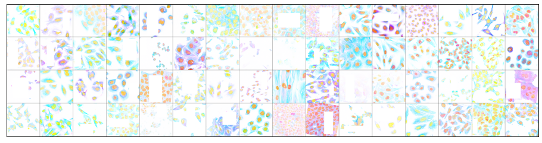
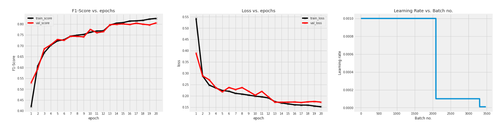

# [Human Protein Classification](https://www.kaggle.com/c/jovian-pytorch-z2g)

---

---

* Competition link: [Zero to GANs - Human Protein Classification](https://www.kaggle.com/c/jovian-pytorch-z2g)
* My kaggle kernel (might differ): [Transfer learning using EfficientNet models](https://www.kaggle.com/veb101/transfer-learning-using-efficientnet-models)
* Latest notebook: [Transfer learning using EfficientNet models](https://jovian.ml/vaibhav-singh-3001/human-protein-competition)
## Introduction

In this kaggle in-class competition, we will develop models capable of classifying mixed patterns of proteins in microscope images. Images visualizing proteins in cells are commonly used for biomedical research, and these cells could hold the key for the next breakthrough in medicine. However, thanks to advances in high-throughput microscopy, these images are generated at a far greater pace than what can be manually evaluated. Therefore, the need is greater than ever for automating biomedical image analysis to accelerate the understanding of human cells and disease.

This is a **multilabel image classification** problem, where each image can belong to several classes. The class labels are as follows:

0. `Mitochondria`,
1. `Nuclear bodies`',
2. `Nucleoli`,
3. `Golgi apparatus`,
4. `Nucleoplasm`,
5. `Nucleoli fibrillar center`,
6. `Cytosol`,
7. `Plasma membrane`,
8. `Centrosome`,
9. `Nuclear speckles`

## Overview

* This competition was solved using the `PyTorch` deep learning framework.
* During the course of the competition, we performed various steps such as:
  
1. Data preparation
2. Building custom Dataset class
3. Performing data augmentations
4. Creating our own train and test dataloaders
5. A wrapper class for dataloaders to move data and model to the GPU memory
6. Building model Base class and our Protein Model class
7. Some helper methods to bind together all our functions together and start the training proces
8. Generating the prediction process.

---

## Training Metrics

